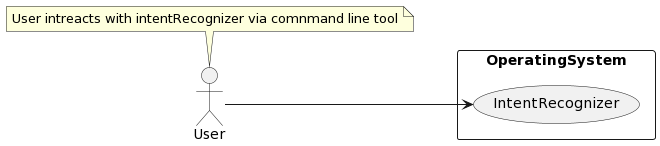
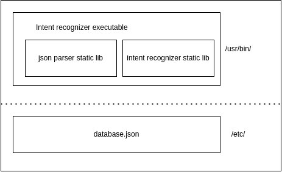

# intent-recognizer-cpp
Intent recognizer is a command line tool which produces the intent of the given sentence via command line.

Some of the examples are given below

```
What is the weather like today? => Prints (Intent: Get Weather)
What is the weather like in Paris today? => Prints (Intent: Get Weather City)
Tell me an interesting fact. => Prints (Intent: Get Fact)
```

# Design 

## High level design 

### Use case 



- User intreacts with the Intent recognizer via command line tool
- Intent recognizer should read the user input and respond with the proper intent and also should print proper error message incase given input is not correct
- Input should be validated before its been processed
- Input length is limited to 10 words for the sake of simplicity and security reasons
- Intent recognizer should handle multiple use cases with out modifying the source and should to be extendable
- There should be loose couple with any third party libraries if used, and should be easily replacable with other library with minimal efforts
  

### Setup



- Intent recognizer is an executable and which depends on two libraries for parsing the json and recognizing the intent of the given input
- Both libaries should be made a static libraries since intent recognizer does only one job of recognizing intent and also to make life simpler
- database.json contains the data used for recognizing the intent of the given sentence

## Low level design

### JSON parser 
- Json parser is a library which is used to parse the JSON file 

*Design pattern used:*
- Adapter design pattern pattern should be used since we are using the thrid part library. Later it should be possible to migrate to other 3rdparty library
- Factory design pattern is used to select the adapter.

### Intent recognizer
- Intent recognizer is a library which does the core job of recognizing the intent of the given input

# Usage
This is a command line tool, So user has to provide his request via command line
```bash
$ IntentRecognizer What is the weather like today?
```
where:
    
    IntentRecognizer - Name of the program
    What is the weather like today? - User entered sentence

# How to make custom changes to the model
The entire IntentRecognizer depends on the `database.json` which is present under `/etc/` directory with read write permission.

Format of the json is as below
```json
{
    "data": {
        "intent": [
            "word1",
            "word2",
            "wordN",
        ]
    }
}
```
In the above json file, user can add as many intents as he wants with the words related to it. 

### default datatbase is 
```json
{
    "data": {
        "City": [
            "Paris",
            "France",
            "India",
            "Germany"
        ],
        "Weather": [
            "Weather"
        ],
        "Fact": [
            "Fact"
        ]
    }
}
```
Above `/etc/database.json` only handles the example sentences given below
```
What is the weather like today? => Prints (Intent: Get Weather)
What is the weather like in Paris today? => Prints (Intent: Get Weather City)
Tell me an interesting fact. => Prints (Intent: Get Fact)
```

Let's say user wants to support following example
```
Can you please help me? => Prints (Intent: Get help)
I need to know the weather? => Prints (Intent: Get weather help)
Is there any support on the issue? => Prints (Intent: Get help)
```
Now updated json looks like this
```json
{
    "data": {
        "City": [
            "Paris",
            "France",
            "India",
            "Germany"
        ],
        "Weather": [
            "Weather"
        ],
        "Fact": [
            "Fact"
        ],
        "Help": [
            "supoort",
            "need",
            "help"
        ]
    }
}
```

## Cmake build steps

### Configure cmake
```
cmake -H. -Bbuild
```

### Configure with debug flag enabled
```
cmake -H. -Bbuild -DCMAKE_BUILD_TYPE=Debug
```

### Build
```
cmake --build build
```

### Executing unit test cases
```
cmake --build build --target test
```

### Installing
```
cmake --build build --target install
```
sudo is required in case permission not present
```
sudo cmake --build build --target install
```

### clean
```
rm -rf build
```

## Dependencies
```
sudo apt install qtbase5-dev
sudo apt-get install cmake
sudo apt install liblog4cplus-dev
```
